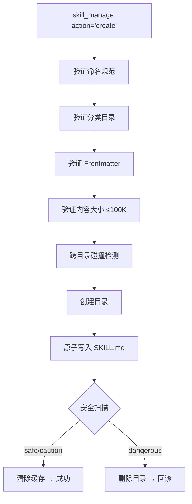
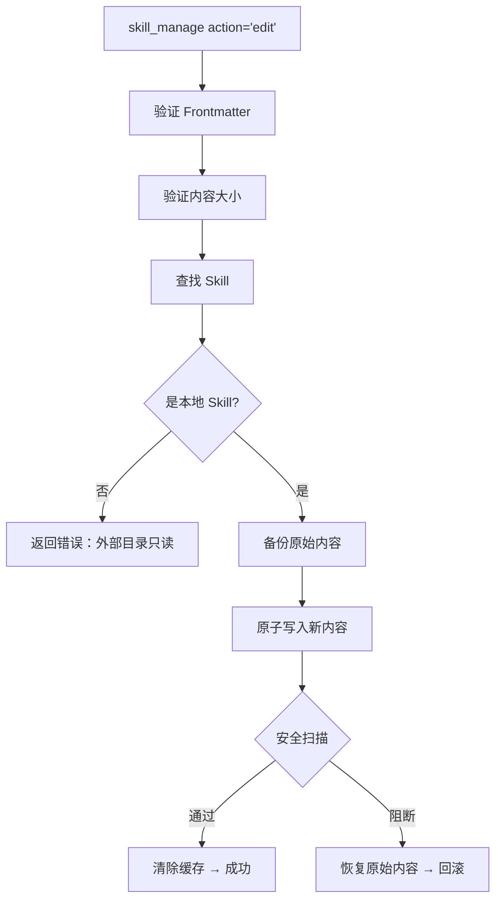
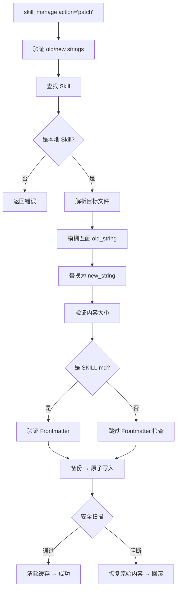
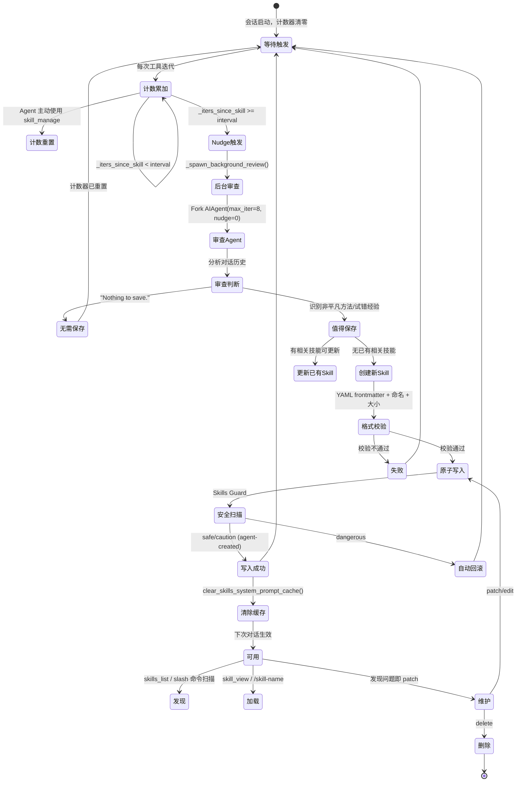

# Hermes Skills 自进化机制 深度解析

> 本文档聚焦 Hermes Agent 中 **Skills（技能）的进化机制**——从触发、审查、创建、安全扫描到维护的完整闭环。不涉及 Memory 记忆系统、会话搜索等非 Skills 机制。

## 目录

- [一、概述](#一概述)
- [二、功能点全景](#二功能点全景)
- [三、模块一：触发与审查](#三模块一触发与审查)
- [四、模块二：Skill CRUD](#四模块二skill-crud)
- [五、模块三：格式与校验](#五模块三格式与校验)
- [六、模块四：安全扫描](#六模块四安全扫描)
- [七、模块五：发现与加载](#七模块五发现与加载)
- [八、模块六：行为引导](#八模块六行为引导)
- [九、完整生命周期](#九完整生命周期)
- [十、相关文件索引](#十相关文件索引)

---

## 一、概述

Hermes Skills 自进化机制的核心命题：**让 Agent 在完成任务的过程中，自动识别值得复用的经验，将其转化为结构化的可执行技能，并确保技能安全、规范、可持续维护。**

| 维度 | 说明 |
|------|------|
| 核心职责 | 将成功经验转化为可复用的程序性知识（Skills） |
| 知识形态 | YAML frontmatter + Markdown 正文（SKILL.md） |
| 进化触发 | 自动（Skill Nudge 计数器）+ 主动（Agent 即时判断） |
| 质量保障 | 格式校验 → 安全扫描 → 自动回滚 |
| 持久化 | `~/.hermes/skills/` 文件系统 |

---

## 二、功能点全景

| 编号 | 模块 | 功能点 | 说明 |
|:----:|:----:|--------|------|
| F1 | **触发与审查** | Skill Nudge 计数触发器 | 基于工具迭代次数自动触发技能审查，可配置间隔 |
| F2 | | 后台审查 Fork 机制 | 主回复交付后启动独立 AIAgent 实例审查对话 |
| F3 | | 审查 Prompt 选择策略 | 根据触发类型选择 Skill/Memory/Combined 审查提示词 |
| F4 | | 审查结果摘要输出 | 扫描审查 Agent 工具消息，输出紧凑操作摘要 |
| F5 | **Skill CRUD** | Skill 创建（create） | 创建新技能目录 + SKILL.md，含完整校验链 |
| F6 | | Skill 编辑（edit） | 完整重写 SKILL.md，适用于大改版 |
| F7 | | Skill 补丁（patch） | 定点模糊替换，推荐用于小修小补 |
| F8 | | Skill 删除（delete） | 删除技能目录并清理空分类目录 |
| F9 | | 辅助文件写入（write_file） | 添加/覆盖 references/templates/scripts/assets 下的文件 |
| F10 | | 辅助文件删除（remove_file） | 删除辅助文件并清理空子目录 |
| F11 | **格式与校验** | YAML Frontmatter 格式校验 | 强制 name+description 字段，验证 YAML 语法和正文存在性 |
| F12 | | 命名规范校验 | 正则 `^[a-z0-9][a-z0-9._-]*$`，≤64 字符 |
| F13 | | 内容大小限制 | SKILL.md ≤100K 字符，辅助文件 ≤1MiB |
| F14 | | 跨目录碰撞检测 | 搜索本地+外部目录防止同名冲突 |
| F15 | | 原子写入 | tempfile + os.replace，防崩溃导致半成品 |
| F16 | **安全扫描** | 安全扫描 + 自动回滚 | 写入后立即扫描，不通过则恢复原始内容或删除 |
| F17 | | 100+ 威胁模式正则检测 | 15 类威胁：数据泄露/注入/破坏/持久化/网络/混淆/执行/穿越/挖矿/供应链/提权/凭证等 |
| F18 | | 结构性检查 | 文件数≤50、总大小≤1MB、禁止二进制、符号链接检测、执行位检测 |
| F19 | | 不可见 Unicode 检测 | 18 种零宽/方向覆盖/BOM 字符检测 |
| F20 | | 4 级信任策略 | builtin/trusted/community/agent-created 对应 safe/caution/dangerous 不同安装策略 |
| F21 | **发现与加载** | Skill 索引缓存（LRU + 磁盘快照） | 双层缓存加速索引构建，mtime/size manifest 验证一致性 |
| F22 | | Slash 命令扫描与注册 | 扫描 SKILL.md 自动注册 /skill-name 命令 |
| F23 | | 模板变量替换 | `${HERMES_SKILL_DIR}` / `${HERMES_SESSION_ID}` 运行时替换 |
| F24 | | 内联 Shell 展开 | `` !`cmd` `` 语法执行 Shell 并替换输出，4K 字符限制+超时保护 |
| F25 | | 配置注入 | 从 config.yaml 注入 metadata.hermes.config 声明的配置值 |
| F26 | | Hub 外部安装 | GitHub/ClawHub/Marketplace 多源安装，quarantine + 扫描 |
| F27 | **行为引导** | 系统提示技能引导 | SKILLS_GUIDANCE 注入系统提示，引导主动保存+即时修补 |
| F28 | | 工具 Schema 描述引导 | skill_manage description 中内嵌创建/更新时机、质量标准指引 |

---

## 三、模块一：触发与审查

> 自动识别"值得保存的技能经验"并启动后台审查，是 Skills 进化的起点。

### F1. Skill Nudge 计数触发器

Skill Nudge 是 Skills 进化的自动触发器，基于工具调用迭代次数工作。

**核心参数：**

| 参数 | 值 | 说明 |
|------|-----|------|
| `_iters_since_skill` | 计数器 | 自上次 skill 工具使用以来的工具迭代次数 |
| `_skill_nudge_interval` | 默认 10 | 触发审查的迭代阈值 |
| 配置来源 | `config.yaml` → `skills.creation_nudge_interval` | 可自定义 |

**计数逻辑（`run_agent.py`）：**

```
每次工具迭代:
  if _skill_nudge_interval > 0 and "skill_manage" in valid_tool_names:
      _iters_since_skill += 1

Agent 主动使用 skill_manage 时:
  _iters_since_skill = 0   # 重置计数器

轮次结束时检查:
  if _iters_since_skill >= _skill_nudge_interval:
      _should_review_skills = True
      _iters_since_skill = 0   # 重置，防止重复触发
```

**设计要点：**

1. **计数器重置策略**：Agent 主动使用 `skill_manage` 时重置计数器，说明 Agent 已有技能意识，无需后台审查推动
2. **工具可用性前置检查**：仅当 `skill_manage` 在当前可用工具列表中时才计数，避免无效计数
3. **频率可配置**：用户可通过 `config.yaml` 调整触发频率，设为 0 可完全禁用

### F2. 后台审查 Fork 机制

当 Skill Nudge 触发后，主 Agent 在交付回复后启动一个后台审查线程。

**实现方式（`_spawn_background_review`，`run_agent.py:2796-2895`）：**

```python
def _spawn_background_review(self, messages_snapshot, review_memory, review_skills):
    def _run_review():
        review_agent = AIAgent(
            model=self.model,          # 同模型
            max_iterations=8,          # 限制迭代
            quiet_mode=True,           # 静默模式
            platform=self.platform,
            provider=self.provider,
        )
        # 共享存储
        review_agent._memory_store = self._memory_store
        review_agent._memory_enabled = self._memory_enabled
        review_agent._user_profile_enabled = self._user_profile_enabled
        # 禁用嵌套审查
        review_agent._memory_nudge_interval = 0
        review_agent._skill_nudge_interval = 0

        review_agent.run_conversation(
            user_message=prompt,
            conversation_history=messages_snapshot,
        )
```

**关键设计：**

| 设计决策 | 说明 |
|---------|------|
| 完整 Agent Fork | 创建独立 AIAgent 实例，拥有完整工具集 |
| 共享 MemoryStore | 直接写入主 Agent 的存储，无需额外同步 |
| 禁用嵌套 Nudge | 两个 interval 设为 0，防止审查触发审查的无限递归 |
| 迭代限制 | `max_iterations=8`，控制审查成本 |
| daemon 线程 | 主进程退出时自动终止 |
| 输出抑制 | `quiet_mode=True` + `redirect_stdout/devnull` |

### F3. 审查 Prompt 选择策略

根据触发类型选择不同审查提示词：

| 触发组合 | 使用的 Prompt |
|---------|--------------|
| 仅 Skill Nudge | `_SKILL_REVIEW_PROMPT` |
| 仅 Memory Nudge | `_MEMORY_REVIEW_PROMPT` |
| 两者同时 | `_COMBINED_REVIEW_PROMPT` |

**`_SKILL_REVIEW_PROMPT` 完整内容：**

> Review the conversation above and consider saving or updating a skill if appropriate.
>
> Focus on: was a non-trivial approach used to complete a task that required trial and error, or changing course due to experiential findings along the way, or did the user expect or desire a different method or outcome?
>
> If a relevant skill already exists, update it with what you learned. Otherwise, create a new skill if the approach is reusable.
> If nothing is worth saving, just say 'Nothing to save.' and stop.

**审查 Prompt 的关注点：**

- 非平凡方法（non-trivial approach）
- 试错过程（trial and error）
- 经验性发现导致路径调整（changing course due to experiential findings）
- 用户期望/要求与实际结果的偏差（user expected or desired a different method or outcome）
- 已有技能的更新（update if relevant skill already exists）

### F4. 审查结果摘要输出

审查完成后，扫描 review_agent 的工具消息，提取成功操作并输出：

```python
for msg in review_agent._session_messages:
    if msg["role"] == "tool" and data.get("success"):
        if "created" in message.lower():
            actions.append(message)
        elif "updated" in message.lower():
            actions.append(message)

if actions:
    self._safe_print(f"  💾 {' · '.join(dict.fromkeys(actions))}")
```

输出示例：`💾 Skill 'debug-fastapi-5xx' created`

---

## 四、模块二：Skill CRUD

> Skill 的核心数据操作：创建、编辑、补丁、删除，以及辅助文件管理。

### F5. Skill 创建（create）

**完整流程（`_create_skill`，`skill_manager_tool.py:304-358`）：**



**各步骤详解：**

| 步骤 | 函数 | 校验规则 | 失败行为 |
|------|------|---------|---------|
| 命名验证 | `_validate_name` | 正则 `^[a-z0-9][a-z0-9._-]*$`，≤64 字符 | 返回错误 |
| 分类验证 | `_validate_category` | 同命名正则，不允许 `/` 或 `\` | 返回错误 |
| Frontmatter | `_validate_frontmatter` | 必须含 `---` 包裹的 YAML，含 `name`+`description`，有正文 | 返回错误 |
| 大小验证 | `_validate_content_size` | ≤100,000 字符 | 返回错误 |
| 碰撞检测 | `_find_skill` | 搜索所有目录（含外部）的 SKILL.md | 返回错误 |
| 安全扫描 | `_security_scan_skill` | 详见模块四 | 回滚（删除目录） |

### F6. Skill 编辑（edit）

完整重写 SKILL.md，适用于大改版：



### F7. Skill 补丁（patch）

定点替换，**推荐用于小修小补**：



**模糊匹配（`tools/fuzzy_match.py`）：**

- 容忍空白差异和缩进不同
- 降低 Agent 精确匹配失败率
- 支持 `replace_all=True` 替换所有匹配

**patch 目标文件：**

| file_path | 目标 |
|-----------|------|
| 未指定 / `"SKILL.md"` | 主文件 |
| `"references/xxx.md"` | 辅助文件 |

### F8. Skill 删除（delete）

```
查找 Skill → 检查本地 → shutil.rmtree() → 清理空分类目录
```

### F9. 辅助文件写入（write_file）

```
验证 file_path → 检查内容大小(≤1MiB) → 查找 Skill → 检查本地 →
解析目标路径 → 备份 → 原子写入 → 安全扫描(不通过则回滚)
```

### F10. 辅助文件删除（remove_file）

```
验证 file_path → 查找 Skill → 检查本地 → 解析目标路径 →
删除文件 → 清理空子目录
```

**辅助文件路径限制：**

| 规则 | 说明 |
|------|------|
| 允许子目录 | `references/`, `templates/`, `scripts/`, `assets/` |
| 路径穿越防护 | 不允许 `..`、绝对路径 |
| 限制在 Skill 目录内 | `resolve()` 后必须在 skill_dir 下 |

---

## 五、模块三：格式与校验

> 写入前的格式校验层：确保 SKILL.md 结构规范、命名合法、大小可控、无命名冲突、写入原子性。

### F11. YAML Frontmatter 格式校验

**`_validate_frontmatter`（`skill_manager_tool.py:150-186`）：**

1. 内容必须以 `---` 开头
2. 必须有闭合的 `---`
3. 两 `---` 之间的 YAML 必须可解析为 dict
4. `name` 字段必填
5. `description` 字段必填
6. frontmatter 之后必须有正文内容（不能只有元数据）

**合法 Frontmatter 示例：**

```yaml
---
name: docker-debug
description: 排查 Docker 容器启动失败的系统化流程
version: 1.0.0
platforms: [macos, linux]
prerequisites:
  env_vars: [DOCKER_HOST]
  commands: [docker, jq]
metadata:
  hermes:
    tags: [docker, debugging]
    related_skills: [k8s-troubleshoot]
    config:
      - key: container_runtime
        default: docker
---

# Docker 调试流程

## 触发条件
...
```

### F12. 命名规范校验

| 规则 | 正则/限制 |
|------|----------|
| 字符集 | `^[a-z0-9][a-z0-9._-]*$` |
| 起始字符 | 必须小写字母或数字 |
| 允许符号 | 连字符 `-`、下划线 `_`、点 `.` |
| 最大长度 | 64 字符 |
| 禁止 | 空格、大写、特殊字符 |

### F13. 内容大小限制

| 项目 | 限制 | 说明 |
|------|------|------|
| SKILL.md 内容 | 100,000 字符（~36K tokens） | `_validate_content_size` |
| 辅助文件 | 1 MiB | `write_file` |
| Skill 总大小 | 1 MB | 结构性检查 |
| 单文件大小 | 256 KB | 结构性检查 |
| 文件数量 | 50 个 | 结构性检查 |

### F14. 跨目录碰撞检测

`_find_skill(name)` 在所有 skill 目录中搜索同名 skill：

```python
def _find_skill(name: str) -> Optional[Path]:
    # 1. 本地目录: SKILLS_DIR
    for path in SKILLS_DIR.rglob("SKILL.md"):
        ...
    # 2. 外部目录: config skills.external_dirs
    for ext_dir in external_dirs:
        for path in ext_dir.rglob("SKILL.md"):
        ...
```

防止在本地目录创建与外部目录同名的 skill。

### F15. 原子写入

**`_atomic_write_text`（`skill_manager_tool.py:268-297`）：**

```python
def _atomic_write_text(file_path, content, encoding="utf-8"):
    fd, tmp_path = tempfile.mkstemp(dir=file_path.parent, prefix=".skill_")
    try:
        with os.fdopen(fd, "w", encoding=encoding) as f:
            f.write(content)
        os.replace(tmp_path, file_path)  # 原子操作
    except BaseException:
        try:
            os.unlink(tmp_path)
        except OSError:
            pass
        raise
```

**设计要点：**

- `tempfile.mkstemp` 在目标目录创建临时文件，确保同文件系统
- `os.replace` 是原子操作（POSIX），读者要么看到完整旧文件，要么看到完整新文件
- 异常时清理临时文件，不留半成品

---

## 六、模块四：安全扫描

> 写入后的安全扫描层：检测威胁模式、验证结构完整性、拦截不可见字符、基于信任策略裁决，不通过则自动回滚。

### F16. 安全扫描 + 自动回滚

每次写入操作后立即执行扫描，不通过则自动回滚：

| 操作 | 回滚策略 |
|------|---------|
| create | `shutil.rmtree()` 删除整个新建 skill 目录 |
| edit | 恢复原始 SKILL.md 内容 |
| patch | 恢复被 patch 文件的原始内容 |
| write_file | 恢复原始文件或删除新文件 |

```python
def _security_scan_skill(skill_dir: Path) -> Optional[str]:
    result = scan_skill(skill_dir, source="agent-created")
    allowed, reason = should_allow_install(result)
    if allowed is False or allowed is None:  # None = "ask"，对 agent-created 即 block
        shutil.rmtree(skill_dir)
        return f"Security scan blocked this skill ({reason}): ..."
```

### F17. 100+ 威胁模式正则检测

`skills_guard.py` 内置 **~85 个威胁模式**，覆盖 **15 个类别**：

| # | 类别 | 示例模式 | 严重性 |
|---|------|---------|--------|
| 1 | **数据泄露** | `curl $TOKEN`, `os.environ`, `cat .env`, DNS 外泄, Markdown 图片/链接泄露, 上下文窗口泄露 | critical/high |
| 2 | **提示注入** | "ignore previous instructions", 角色劫持, 欺骗, 系统提示覆盖 | critical/high |
| 3 | **越狱** | DAN mode, developer mode, "respond without safety filters" | critical/high |
| 4 | **破坏性操作** | `rm -rf /`, `chmod 777`, `mkfs`, `dd if= of=/dev/`, `rmtree`, `truncate` | critical |
| 5 | **持久化** | `crontab`, `.bashrc`, `authorized_keys`, `systemd`, `launchd`, `sudoers`, `git config --global`, Agent 配置文件(AGENTS.md等) | medium/critical |
| 6 | **网络攻击** | 反向 shell(nc/socat), 隧道(ngrok), 硬编码 IP:端口, bash/python 反向 shell, 外泄服务(webhook.site/pastebin) | critical/high |
| 7 | **混淆** | base64 解码管道, hex 编码, `eval()`/`exec()`, echo-pipe-exec, `getattr builtins`, `__import__`, codecs, JS charCode/atob, chr 拼接, unicode 转义 | high/medium |
| 8 | **执行** | `subprocess`, `os.system`, `os.popen`, Node `child_process`, Java `Runtime.exec`, 反引号子 shell | medium/high |
| 9 | **路径穿越** | `../../../`, `/etc/passwd`, `/proc` 访问, `/dev/shm` | critical/high |
| 10 | **加密挖矿** | `xmrig`, `monero`, `coinhive`, `stratum+tcp` | critical/medium |
| 11 | **供应链** | `curl\|sh`, 未锁定版本安装, `uv run`, 远程 fetch, `git clone`, `docker pull`, PEP 723 inline deps | critical/medium |
| 12 | **权限提升** | `allowed-tools` 字段, `sudo`, `setuid/setgid`, `NOPASSWD`, SUID bit | critical/high |
| 13 | **凭证暴露** | 硬编码密钥, 嵌入私钥, 泄露 GitHub/OpenAI/Anthropic/AWS key | critical |

**模式数据结构：**

```python
@dataclass
class Finding:
    pattern_id: str      # 如 "env_exfil_curl"
    severity: str        # critical / high / medium / low
    category: str        # 如 "exfiltration"
    file: str            # 相对路径
    line: int            # 行号
    match: str           # 匹配文本
    description: str     # 威胁说明
```

### F18. 结构性检查

`_check_structure`（`skills_guard.py:734-848`）：

| 检查项 | 限制 | 严重性 |
|--------|------|--------|
| 文件总数 | ≤ 50 | medium |
| 总大小 | ≤ 1 MB | high |
| 单文件大小 | ≤ 256 KB | medium |
| 二进制文件 | `.exe/.dll/.so/.dylib/.bin/.dat/.com/.msi/.dmg/.app/.deb/.rpm` 禁止 | critical |
| 符号链接 | 不允许指向 skill 目录外 | critical |
| 可执行权限 | 非脚本文件不应有执行位 | medium |

### F19. 不可见 Unicode 检测

检测 18 种可能用于隐藏注入的不可见字符：

| Unicode 范围 | 名称 | 用途 |
|-------------|------|------|
| U+200B | Zero Width Space | 隐藏字符注入 |
| U+200C | Zero Width Non-Joiner | 隐藏字符注入 |
| U+200D | Zero Width Joiner | 隐藏字符注入 |
| U+2060 | Word Joiner | 隐藏字符注入 |
| U+FEFF | BOM | 文本隐藏 |
| U+202A-U+202E | RTL/LTR 覆盖 | 文本方向欺骗 |
| U+2066-U+2069 | 方向性隔离 | 文本方向欺骗 |

### F20. 四级信任策略

扫描结果产生三种裁决（verdict）：**safe** / **caution** / **dangerous**

| 信任等级 | safe | caution | dangerous |
|----------|------|---------|-----------|
| **builtin**（内置） | allow | allow | allow |
| **trusted**（openai/skills, anthropics/skills） | allow | allow | **block** |
| **community**（社区） | allow | **block** | **block** |
| **agent-created**（Agent 自建） | allow | allow | **ask**（实际 block） |

**裁决逻辑：**

```python
def _determine_verdict(findings):
    severities = {f.severity for f in findings}
    if "critical" in severities:
        return "dangerous"
    if severities & {"high", "medium", "low"}:
        return "caution"
    return "safe"
```

**Agent 自建的特殊处理：**

- `ask` 裁决在自动化流程中等同于 `block`（没有人类交互通道）
- 信任等级最宽松：caution 级别允许通过
- 但 dangerous 仍被阻断

---

## 七、模块五：发现与加载

> 已创建技能的发现、索引、缓存、加载与外部安装机制。

### F21. Skill 索引缓存（LRU + 磁盘快照）

**Layer 1：进程内 LRU 缓存**

```python
_SKILLS_PROMPT_CACHE_MAX = 8
_SKILLS_PROMPT_CACHE: OrderedDict[tuple, str] = OrderedDict()
```

**Layer 2：磁盘快照**

```
~/.hermes/.skills_prompt_snapshot.json
```

**缓存查找链：**

```
build_skills_system_prompt()
  → 1. 构建 cache_key = (skills_dir, external_dirs, ...)
  → 2. 查 LRU 缓存 → 命中则返回
  → 3. 查磁盘快照 → 验证 manifest → 有效则返回
  → 4. 全量扫描 skill 目录 → 解析 frontmatter → 构建 index
  → 5. 写入 LRU + 磁盘快照
```

**Manifest 有效性验证：**

```python
def _build_skills_manifest(skills_dir):
    # 扫描所有 SKILL.md 和 DESCRIPTION.md 的 mtime + size
    manifest[str(path.relative_to(skills_dir))] = [st.st_mtime_ns, st.st_size]
```

磁盘快照的 manifest 与当前文件系统对比，任何变更都会使快照失效。

**缓存清除触发：**

- `skill_manage` 任何操作成功后：`clear_skills_system_prompt_cache(clear_snapshot=True)`
- 删除磁盘快照文件 + 清空 LRU

### F22. Slash 命令扫描与注册

`agent/skill_commands.py` 中的 `scan_skill_commands()` 扫描所有 skill 目录，为每个 skill 注册 `/skill-name` 命令：

```
~/.hermes/skills/ → rglob("SKILL.md") → 解析 frontmatter → 注册 /command
```

**命令名生成规则：**

- 统一转为小写
- 空格和下划线 → 连字符
- 去除非字母数字字符
- 合并连续连字符

### F23. 模板变量替换

`_substitute_template_vars`（`skill_commands.py:53-76`）：

| 变量 | 替换为 | 示例 |
|------|-------|------|
| `${HERMES_SKILL_DIR}` | skill 的绝对目录路径 | `/home/user/.hermes/skills/docker-debug` |
| `${HERMES_SESSION_ID}` | 当前会话 ID | `abc123` |

未解析的变量保持原样，方便调试。

### F24. 内联 Shell 展开

`_expand_inline_shell`（`skill_commands.py:79-100`，需配置开启）：

```markdown
Today is !`date +%Y-%m-%d`
```

- 以 skill 目录为 CWD，支持相对路径
- 输出限制 4000 字符
- 超时保护
- 失败返回 `[inline-shell error: ...]` 标记，不影响整个 skill 加载

### F25. 配置注入

如果 skill 的 frontmatter 声明了 `metadata.hermes.config`，加载时从 `config.yaml` 解析当前配置值并注入：

```
[Skill config (from ~/.hermes/config.yaml):
  model_name = gpt-4
  api_key = (not set)
]
```

### F26. Hub 外部安装

`tools/skills_hub.py` 支持从外部源安装技能：

| 来源 | 适配器 | 信任等级 |
|------|--------|----------|
| GitHub 仓库 | `GitHubSource` | trusted（仅 openai/skills, anthropics/skills）/ community |
| 官方可选技能 | `OptionalSkillSource` | builtin |
| ClawHub | 远程索引 | community |
| Claude Marketplace | 远程索引 | community |

**安装流程：**

```
搜索 → 下载 SkillBundle → 放入 quarantine → 安全扫描
    → 通过 → 安装到 skills/
    → 阻断 → 留在 quarantine
```

Hub 安装的 skills 使用更严格的信任策略（community：caution 即 block）。

---

## 八、模块六：行为引导

> 通过系统提示和工具描述引导 Agent 主动创建、维护技能，形成进化闭环。

### F27. 系统提示技能引导（SKILLS_GUIDANCE）

注入到系统提示中的行为指导（`prompt_builder.py:170-177`）：

> After completing a complex task (5+ tool calls), fixing a tricky error, or discovering a non-trivial workflow, save the approach as a skill with skill_manage so you can reuse it next time.
> When using a skill and finding it outdated, incomplete, or wrong, patch it immediately with skill_manage(action='patch') — don't wait to be asked. Skills that aren't maintained become liabilities.

**注入条件：**

```python
if "skill_manage" in self.valid_tool_names:
    tool_guidance.append(SKILLS_GUIDANCE)
```

仅在 skill_manage 工具可用时注入。

### F28. 工具 Schema 描述引导

`SKILL_MANAGE_SCHEMA` 的 `description` 字段包含详细的使用指导：

| 引导内容 | 说明 |
|---------|------|
| 创建时机 | 复杂任务(5+调用)、错误修复、用户纠正、非平凡工作流、用户要求记住 |
| 更新时机 | 指令过时/错误、OS 特定失败、缺少步骤或陷阱 |
| 行为要求 | 使用 skill 时发现问题立即 patch |
| 主动建议 | 困难/迭代任务后主动提议保存 |
| 跳过场景 | 简单一次性任务 |
| 质量标准 | 触发条件、编号步骤+精确命令、陷阱章节、验证步骤 |
| 参考格式 | 使用 `skill_view()` 查看格式示例 |

---

## 九、完整生命周期



---

## 十、相关文件索引

| 文件 | 职责 | 关键符号 |
|------|------|---------|
| `run_agent.py` | AIAgent 主循环，Nudge 计数器，后台审查 | `_iters_since_skill`, `_skill_nudge_interval`, `_should_review_skills`, `_spawn_background_review`, `_SKILL_REVIEW_PROMPT` |
| `tools/skill_manager_tool.py` | Skill CRUD 工具入口 | `skill_manage`, `_create_skill`, `_edit_skill`, `_patch_skill`, `_delete_skill`, `_write_file`, `_remove_file`, `_validate_frontmatter`, `_validate_name`, `_atomic_write_text`, `_security_scan_skill` |
| `tools/skills_guard.py` | 安全扫描引擎 | `scan_skill`, `should_allow_install`, `scan_file`, `_check_structure`, `Finding`, `ScanResult`, `INSTALL_POLICY`, `THREAT_PATTERNS` |
| `tools/skills_tool.py` | Skill 列出/查看工具 | `skills_list`, `skill_view`, `SKILLS_LIST_SCHEMA`, `SKILL_VIEW_SCHEMA` |
| `tools/skills_hub.py` | Hub 外部安装适配器 | `GitHubSource`, `OptionalSkillSource`, `DEFAULT_TAPS` |
| `tools/fuzzy_match.py` | Patch 用的模糊匹配引擎 | `fuzzy_find_and_replace` |
| `tools/path_security.py` | 路径安全校验 | 防穿越 |
| `agent/prompt_builder.py` | 系统提示组装 + 索引缓存 | `SKILLS_GUIDANCE`, `build_skills_system_prompt`, `clear_skills_system_prompt_cache`, `_SKILLS_PROMPT_CACHE` |
| `agent/skill_commands.py` | Slash 命令扫描、加载、模板展开 | `scan_skill_commands`, `_substitute_template_vars`, `_expand_inline_shell` |
| `agent/skill_utils.py` | Skill 工具函数 | frontmatter 解析、外部目录 |
